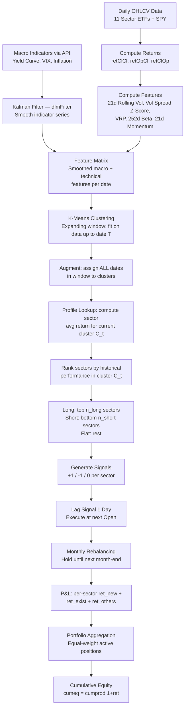

# FIN 452 — Strategy Context & Mental Model
Last updated: 2026-04-05

> **Graded deliverable.** Single source of truth for all strategy design decisions. Every line of code in `trading_strategy.qmd` must trace back to something documented here.

---

# Part I: Project Requirements

> Immutable reference. Constraints, deadlines, and code patterns mandated by the course.

---

## 1. Deliverables & Deadlines

| Item | Format | Details |
|------|--------|---------|
| Quarto source | `.qmd` file | All analysis in R, no Python |
| Rendered output | **Self-contained HTML** | All resources embedded. **-5 points** if professor has to re-render. |
| Strategy context | `context.md` | This file — living document, **graded deliverable** |
| GitHub repo | **Public** | Daily commits. **-5 points** for single commit on submission day. |
| Presentation | 10 minutes, in class | Recorded for grading only. May be peer-graded. |

| Item | Date |
|------|------|
| **Due date** | **2026-04-07, 6:00 PM Edmonton time** |
| Presentation | In class on 2026-04-07 |
| Submission | Email with GitHub repo link |

## 2. Grading

| Detail | Value |
|--------|-------|
| Weight | **20%** of course grade |
| Type | Individual assignment |
| Penalties | -5 non-self-contained HTML; -5 no daily commits; penalty for Python |

## 3. Hard Constraints

### 3.1 Asset Universe (FIXED)

| Ticker | Sector | Available From |
|--------|--------|---------------|
| **SPY** | S&P 500 (benchmark) | 1993 |
| XLB | Materials | 1998 |
| XLC | Communication Services | **2018** |
| XLE | Energy | 1998 |
| XLF | Financials | 1998 |
| XLI | Industrials | 1998 |
| XLK | Technology | 1998 |
| XLP | Consumer Staples | 1998 |
| XLRE | Real Estate | **2015** |
| XLU | Utilities | 1998 |
| XLV | Health Care | 1998 |
| XLY | Consumer Discretionary | 1998 |

### 3.2 Time Periods (FIXED)

| Period | Range |
|--------|-------|
| **Training** | **June 2000 – December 2024** |
| **Testing** | **January 2025 – March 2026** |

### 3.3 Strategy Method (MANDATORY)

| Requirement | Detail |
|-------------|--------|
| **Clustering** | PRIMARY method to drive signals |
| **Kalman Filter** | IN CONJUNCTION with clustering |
| Indicators | Free to use any |
| Trading frequency | **Daily** |
| Rebalancing | **Monthly** |

### 3.4 Technical Requirements

| Requirement | Detail |
|-------------|--------|
| Language | **R only** — Python penalized |
| Document | **Quarto** (.qmd) |
| Workflow | **tidymodels** |
| Data | **All via APIs** — no local CSV/Excel |
| Mental model | **Mermaid charts** |
| Code-model match | Code must match diagram |

## 4. Required Components

### 4.1 Data & Returns
- [ ] Load all SPDR sector ETFs + SPY via `tidyquant::tq_get()`
- [ ] Adjust OHLC via `quantmod::adjustOHLC()`
- [ ] Compute returns: `retClCl`, `retOpCl`, `retClOp`
- [ ] Handle XLC (2018) and XLRE (2015) availability gaps
- [ ] Load indicator data via APIs (FRED, Yahoo)

### 4.2 Clustering (PRIMARY)
- [ ] Select features/indicators for clustering input
- [ ] Implement via `tidymodels` framework
- [ ] Clustering drives core trading signal logic
- [ ] Document cluster interpretation (economic meaning)

### 4.3 Kalman Filter (REQUIRED)
- [ ] Implement on relevant indicators
- [ ] Use in conjunction with clustering for trade signals
- [ ] Document how it complements clustering

### 4.4 Mermaid Mental Model
- [ ] Flowchart: data → indicators → clustering → Kalman → signal → trade
- [ ] Code must match diagram exactly

### 4.5 Trade & Position Logic
- [ ] Signals: {+1, -1, 0} per sector
- [ ] Lag signals (day T signal → T+1 open execution)
- [ ] Monthly rebalancing cadence
- [ ] `trade`, `pos`, `ret_new`, `ret_exist`, `ret_others`, `cumeq` columns

### 4.6 Strategy Function & Optimization
- [ ] Wrap strategy in function
- [ ] Parameter grid via `expand.grid()`
- [ ] Multi-core via `foreach` + `doParallel`
- [ ] Optimize on TRAINING period only

### 4.7 Risk/Reward Assessment
- [ ] `RTL::tradeStats()` metrics
- [ ] Explicit risk appetite thresholds with justification
- [ ] Filter and select from robust parameter clusters

### 4.8 Visualization
- [ ] Price charts with trades, positions, cumulative equity
- [ ] 3D wireframe / plotly surfaces for optimization
- [ ] Heatmaps with Z-score normalization
- [ ] Drawdown charts
- [ ] Correlation analysis
- [ ] **Mermaid decision flowchart** (mandatory)
- [ ] Cluster visualization (PCA/t-SNE or similar)

### 4.9 Backtesting
- [ ] Walk-forward on test period with optimized parameters
- [ ] Compare vs buy-and-hold SPY
- [ ] Full tradeStats on backtest
- [ ] Robustness discussion

### 4.10 Presentation
- [ ] 10-minute presentation
- [ ] Thesis → method → results → conclusions

## 5. Bias Warnings

| Trap | How to Avoid |
|------|-------------|
| Survivorship bias | Fixed SPDR universe; note XLC/XLRE start dates |
| Look-ahead bias | Lag all signals; expanding window clustering; economic data in arrears |
| Data mining/snooping | Optimize on training only; backtest untouched |
| Storytelling | Economic rationale before fitting |
| Transaction costs | Acknowledge bid/offer, slippage |
| Outlier dependence | Check performance isn't driven by 1-2 events |
| Adjusted prices | Use `adjustOHLC()` |

## 6. Required R Packages

| Package | Purpose |
|---------|---------|
| `tidyverse` | Data wrangling |
| `tidyquant` | Yahoo Finance data |
| `tidymodels` | **Mandatory workflow** |
| `tidyclust` | tidymodels-compatible clustering |
| `timetk` | xts ↔ tibble conversion |
| `TTR` | Technical indicators |
| `PerformanceAnalytics` | Risk/return analytics |
| `xts` / `zoo` | Time series objects |
| `quantmod` | OHLC adjustment |
| `RTL` | Professor's package — `tradeStats()` |
| `lattice` | 3D wireframe |
| `plotly` | Interactive surfaces |
| `foreach` / `doParallel` | Multi-core optimization |
| `dlm` | Kalman filter |
| `cluster` / `factoextra` | Clustering algorithms & visualization |
| `fredr` | FRED API data (T10YIE breakeven inflation; rates moved to Yahoo) |

## 7. Reference Code Patterns

### 7.1 Data Loading & OHLC Adjustment
```r
dat <- tidyquant::tq_get("SPY", from = "2000-01-01") %>%
  dplyr::rename_all(tools::toTitleCase) %>%
  timetk::tk_xts(date_var = Date) %>%
  quantmod::adjustOHLC(., use.Adjusted = TRUE) %>%
  timetk::tk_tbl(rename_index = "Date") %>%
  dplyr::select(-Adjusted) %>%
  dplyr::mutate(across(where(is.numeric), round, 2)) %>%
  dplyr::rename(date = Date)
```

### 7.2 Three Return Types
```r
retClCl = Close / dplyr::lag(Close) - 1,
retOpCl = (Close - Open) / Close,
retClOp = Open / dplyr::lag(Close) - 1,
```

### 7.3 Signal → Trade → Position → P&L Chain
```r
signal = dplyr::case_when(condition1 ~ 1, condition2 ~ -1, TRUE ~ 0),
trade = tidyr::replace_na(dplyr::lag(signal) - dplyr::lag(signal, n = 2L), 0),
pos = cumsum(trade),
ret_new    = ifelse(pos == trade, pos * retOpCl, 0),
ret_exist  = ifelse(pos != 0 & trade == 0, pos * retClCl, 0),
ret_others = dplyr::case_when(
  (pos - trade) != 0 & trade != 0 ~
    (1 + retClOp * (pos - trade)) * (1 + retOpCl * pos) - 1,
  TRUE ~ 0
),
ret = ret_new + ret_exist + ret_others,
cumeq = cumprod(1 + ret)
```

### 7.4 Strategy Function Template
```r
strategy <- function(data, par1, par2, ...) {
  data <- data %>% dplyr::mutate(...)
  return(data)
}
```

### 7.5 Optimization Grid + Multi-Core
```r
out <- expand.grid(par1 = seq(...), par2 = seq(...))
cl <- makeCluster(detectCores() - 1)
registerDoParallel(cl)
res <- foreach(i = 1:nrow(out), .combine = "cbind",
  .packages = c("tidyverse", "RTL", "timetk", "tidyquant", "PerformanceAnalytics")
) %dopar% {
  as.numeric(RTL::tradeStats(
    strategy(data = train, out[i, "par1"], out[i, "par2"]) %>%
      dplyr::select(date, ret)
  ))
}
stopCluster(cl)
res <- tibble::as_tibble(t(res))
colnames(res) <- names(RTL::tradeStats(x = check %>% dplyr::select(date, ret)))
out <- cbind(out, res)
```

### 7.6 tradeStats Output
`RTL::tradeStats()` returns: `CumReturn`, `Ret.Ann`, `SD.Ann`, `Sharpe`, `Omega`, `%.Win`, `%.InMrkt`, `DD.Length`, `DD.Max`

### 7.7 Charting Pattern (xts-based)
```r
tmp <- result %>% timetk::tk_xts(date_var = date)
plot(tmp$Close, main = "Strategy Results")
xts::addSeries(tmp$trade, main = "Trades", on = NA, type = "h", col = "blue")
xts::addSeries(tmp$pos, main = "Positions", on = NA, type = "h", col = "blue")
xts::addSeries(tmp$cumeq, main = "CumEQ", on = NA, type = "l", col = "blue")
```

### 7.8 Optimization Visualization
```r
lattice::wireframe(out$Sharpe ~ out$par1 * out$par2, shade = TRUE, drape = TRUE)
plotly::plot_ly(x = ~par2_vals, y = ~par1_vals, z = ~matrix) %>% add_surface()

outZ <- out %>%
  tidyr::pivot_longer(cols = -c(par1, par2), names_to = "variable", values_to = "value") %>%
  dplyr::group_by(variable) %>%
  dplyr::mutate(valueZ = (value - mean(value)) / sd(value))
outZ %>% ggplot(aes(x = par1, y = par2)) +
  geom_raster(aes(fill = valueZ), interpolate = TRUE) +
  facet_wrap(~variable, scales = "free") +
  scale_fill_gradient2(low = "red", mid = "white", high = "blue", midpoint = 0)
```

### 7.9 Risk Appetite Filtering
```r
out %>%
  dplyr::filter(Sharpe > 0.2, DD.Max > -0.30) %>%
  dplyr::arrange(desc(Sharpe)) %>%
  top_n(10)
```

### 7.10 Drawdown Analysis
```r
sp.ret <- TTR::ROC(quantmod::Cl(xts_obj), type = "discrete")
PerformanceAnalytics::table.Drawdowns(sp.ret, top = 25)
PerformanceAnalytics::chart.Drawdown(sp.ret, main = "Drawdowns", col = "blue")
```

### 7.11 Correlation Analysis
```r
PerformanceAnalytics::chart.Correlation(
  data.frame(asset = retClCl, strategy = ret) %>% tidyr::drop_na(),
  histogram = TRUE
)
```

### 7.12 Key Performance Questions
- Buy-and-hold return: `last(Close) / first(Close)`
- Risk-free return: fixed horizon vs rolling daily rate
- Strategy cumulative return: `RTL::tradeStats(...)["CumReturn"]`
- Robustness if market regime changes?

---

# Part II: Ground Truth & Established Strategy

> Validated decisions and domain knowledge. Items here are confirmed and should not change without a decision log entry.

---

## A. Domain Knowledge

### Sector Classification (Three-Way Split)

The standard framework has three groups. This classification drives the `cyc_def_ratio` and `vol_dispersion` clustering features.

| Group | Sectors | Characteristic |
|-------|---------|----------------|
| **Cyclical** | XLY, XLB, XLI, XLF | Tied to domestic economic expansion/contraction |
| **Defensive** | XLP, XLU, XLV | Inelastic demand, hold up in downturns |
| **Sensitive** | XLE, XLK, XLC | Driven by their own cycles (oil, tech growth, ad spend) |
| **Rate-proxy** | XLRE, XLU | Rate-sensitive (XLU appears in both defensive and rate-proxy) |

Common misclassification: XLC is NOT defensive — it's Meta, Alphabet, Netflix, Disney (growth/ad-spend driven). XLK is NOT a traditional cyclical — it's long-duration growth, crushed by rate hikes specifically.

### Volatility Concepts

**VIX** — CBOE 30-day implied volatility for SPX options. Forward-looking market fear gauge. Published at market close. Annualised percentage (e.g. 20 = 20%).

**Realized volatility** — backward-looking rolling standard deviation of returns, annualised: `roll_partial(retClCl, width = 21, FUN = sd, min_obs = 5) * sqrt(252) * 100`. Window is 21 trading days (= 30 calendar days × 252/365), matching VIX's 30-calendar-day horizon. Must use `align = "right"` to avoid lookahead. Partial window via `roll_partial()` allows values from first month of ETF existence.

**VRP (Volatility Risk Premium)** = VIX − SPY_rvol_21. Uses 21-trading-day realized vol to match VIX's 30-calendar-day horizon (apples-to-apples).
- Positive: market paying up for protection (fear premium)
- Near zero: well-priced regime
- Negative: crash worse than anticipated (mid-event signal)

**Vol spread z-score** — For each sector: `spread = sector_rvol_21 - VIX`, then rolling z-score over 252 days. Removes each sector's structural vol relationship with VIX so z-scores are directly comparable across sectors. A z-score of +2 means the sector is 2sd more stressed vs VIX than its historical norm.

Why z-score over raw spread: some sectors (XLP) always have vol below VIX; others (XLE) frequently above. Raw spread levels reflect sector character, not regime state. Only deviations from that sector's own norm capture regime change.

### Lookahead Bias Rules

| Layer | Rule |
|-------|------|
| Kalman filter | Use `dlmFilter()` (causal, online). NEVER `dlmSmooth()` (retrospective, uses future data). |
| Rolling calculations | Always `align = "right"` in `rollapply`. Never `"center"`. |
| Signal execution | Signal on day T close → execute at T+1 open minimum. Course pattern: `lag(signal)` in trade column. |
| Clustering | Expanding window only. At each rebalancing date, fit K-means on data up to that date. Never full-sample then assign retroactively. |
| Rate data | ^TNX, ^IRX (Yahoo), VIX, T10YIE are market-observable same-day. No additional publication lag needed beyond the 1-day execution lag. |

---

## B. Strategy Design

### 1. Investment Thesis

**Core claim:** Financial markets exhibit distinct regime states — risk-on, risk-off, transitional — identifiable by clustering macro and technical indicators. Sectors respond differently to each regime. By (1) classifying the current regime via clustering, (2) smoothing noisy indicators with a Kalman filter, and (3) rotating into sectors that historically outperform in the detected regime, we build a systematic sector rotation strategy that outperforms buy-and-hold SPY.

**Economic mechanism:**
- **Regime existence:** Markets cycle through expansion, contraction, and transition. Driven by monetary policy, credit conditions, growth expectations. Different sectors have different sensitivities.
- **Why clustering?** Regimes are multivariate — no single indicator captures them. K-means identifies natural groupings without arbitrary thresholds.
- **Why Kalman filter?** Raw indicators are noisy. Kalman filter smooths them before clustering, reducing spurious regime changes while preserving real shifts. Provides a probabilistic framework.

**Why this beats simple SMA crossover:**
- Multi-dimensional regime detection vs single price-based rule
- Economically grounded in business cycle theory
- Adaptive — clusters learned from data, not hand-tuned
- Kalman smoothing adds robustness

### 2. Universe & Instruments

See Part I §3.1 for the fixed asset universe.

**Data sources (all via API):**

| Data | Source | R Package | Frequency |
|------|--------|-----------|-----------|
| Sector ETF OHLCV | Yahoo Finance | `tidyquant::tq_get()` | Daily |
| SPY OHLCV | Yahoo Finance | `tidyquant::tq_get()` | Daily |
| VIX (^VIX) | Yahoo Finance | `tidyquant::tq_get()` | Daily |
| 10Y Treasury yield (^TNX) | Yahoo Finance | `tidyquant::tq_get()` | Daily |
| 2Y Treasury yield (DGS2) | FRED | `fredr::fredr()` | Daily |
| Breakeven inflation (T10YIE) | FRED | `fredr` | Daily |

**Data availability within training:**

| Period | Available Sectors |
|--------|------------------|
| Jun 2000 – Sep 2015 | 9 sectors (no XLRE, no XLC) + SPY |
| Oct 2015 – May 2018 | 10 sectors (add XLRE) + SPY |
| Jun 2018 – Dec 2024 | All 11 sectors + SPY |

**Handling:** Clustering uses available sectors at each date. Sector rankings within each cluster computed only for sectors that existed during that cluster's historical periods.

### 3. Signal Architecture

Three-layer pipeline: Raw Data → Kalman-Filtered Indicators → Clustering → Regime → Sector Allocation.

#### Layer 1: Indicator Features (Confirmed)

| Feature | Computation | Window | Economic Meaning |
|---------|-------------|--------|-----------------|
| Yield curve slope | 10Y − 3M (^TNX − ^IRX) | — | Monetary policy stance / recession signal (NY Fed preferred) |
| VIX level | Raw VIX close | — | Market-wide implied fear (forward-looking) |
| Breakeven inflation | T10YIE | — | Inflation expectations |
| 21d rolling vol per sector | `roll_partial(retClCl, 21, sd) * √252 * 100` | 21d | Sector-specific realized stress |
| Vol spread z-score | `(sector_rvol_21 − VIX)` z-scored over 252d | 21d vol, 252d z-score | Regime-pure sector stress vs market fear |
| VRP | VIX − SPY_rvol_21 | 21d | Fear premium; market over/under-pricing risk |
| 252d rolling beta to SPY | `cov(sector, SPY) / var(SPY)` rolling 252d | 252d | Sector coupling/decoupling from market |
| 21d rolling log return | `log(price_t / price_{t-21})` | 21d | Short-term momentum per sector |

#### Layer 2: Kalman Filter (Option A — Filter Before Clustering)

**Confirmed approach:** Apply Kalman filter to each indicator time series before clustering.

Pipeline: raw data → `dlmFilter()` with local level model → smoothed indicators → clustering input.

**Implementation:**
- `dlm` package; local level model (random walk + noise)
- MLE-estimated V (observation noise) and W (process noise) per indicator
- Use `dlmFilter()` output only (causal). Never `dlmSmooth()`.
- Stress-test lag at known turning points: Sep 2008, Mar 2020, Jan 2022. If lag > 45 days → raise W.

#### Layer 3: Clustering (Primary Signal)

**Method:** K-means via `tidyclust` / `tidymodels` workflow.

**Critical implementation rules:**
1. **Cluster time periods** (each row = one date's indicator values), NOT sectors.
2. **Expanding window** — at each monthly rebalancing date, fit K-means on all data up to that date only.
3. **Never carry cluster integers across refits** — K-means relabels arbitrarily every refit. The correct flow at each rebalancing date T:
   - Fit K-means on data[1:T] → get assignments for ALL rows
   - Identify which cluster date T belongs to → `c_t`
   - Find all past dates assigned to `c_t` in THIS fit
   - Compute sector rankings from those dates only
   - Generate signals from rankings
4. **Cluster labels have no fixed economic meaning** — interpret each cluster dynamically by its centroid values at that refit (e.g., high VIX + inverted yield curve = contraction).

**tidymodels workflow:**

| Component | Usage |
|-----------|-------|
| `recipes::recipe()` | Preprocess: `step_normalize()`, `step_naomit()` |
| `tidyclust::k_means()` | Clustering model spec |
| `workflows::workflow()` | Bundle recipe + model |
| `augment()` | Extract cluster assignments |

### 4. Signal Combination Logic

```
MONTHLY REBALANCING CYCLE (last trading day of each month):

1. COLLECT current values of all indicators (Layer 1)
2. APPLY Kalman filter (dlmFilter) to smooth indicator series
3. CLUSTER: fit K-means on expanding window, assign current month to regime
4. LOOKUP: within SAME fit, find all dates in current cluster, compute sector return rankings
5. ALLOCATE:
   - Long: top n_long sectors (highest historical avg return in this cluster)
   - Short: bottom n_short sectors (or flat if long-only)
   - Flat: middle sectors
6. GENERATE signals: +1 (long), -1 (short), 0 (flat) per sector
7. LAG: signals from month-end T → execute at open of first trading day T+1
8. HOLD positions for entire month
```

**Multi-asset portfolio aggregation (corrected):**
- Per-sector: compute `ret_new`, `ret_exist`, `ret_others` using course pattern with pos ∈ {0, +1, -1}
- Portfolio: weight each active long position at `1/n_active_longs`, each short at `-1/n_active_shorts`
- Total long exposure = 100%, total short exposure = 100%
- DO NOT naively average across all 11 sectors (causes ~73% cash drag)
- Uninvested cash earns 0% (conservative; documented)

### 5. Execution Model

| Parameter | Value | Rationale |
|-----------|-------|-----------|
| Signal generation | Last trading day of month (after close) | Monthly rebalancing |
| Trade execution | Open of first trading day of next month | Realistic |
| Signal lag | 1 trading day minimum | Built into trade logic |
| Position sizing | Equal-weight across active positions | Simple |
| Rebalancing | Monthly | Project requirement |
| Slippage | Acknowledged; sector ETFs are highly liquid | Course expects awareness |
| Transaction costs | Acknowledged qualitatively | ~12 trades/year per sector |

**P&L computation:** See Part I §7.3 for the course-mandated pattern.

### 6. Train/Test Split

| Period | Dates | Duration |
|--------|-------|----------|
| **Training** | June 2000 – December 2024 | 24.5 years |
| **Testing** | January 2025 – March 2026 | 15 months |

Fixed by project brief.

### 7. Optimization Design

| Parameter | Range | Count | Rationale |
|-----------|-------|-------|-----------|
| `n_clusters` (K) | 2, 3, 4, 5 | 4 | Too few = no differentiation; too many = overfitting |
| `momentum_lookback` | 20, 40, 60, 90, 120 days | 5 | Multiple momentum horizons |
| `n_long` | 2, 3, 4 | 3 | Concentration vs diversification |
| `n_short` | 0, 2, 3 | 3 | 0 = long-only variant |

**Total:** 4 × 5 × 3 × 3 = **180 combinations** (tractable with `doParallel`)

**Objective:** Maximize Sharpe Ratio on training data.

**Kalman parameters:** Fixed at MLE defaults, not optimized.

**Overfitting mitigation:**
1. Coarse grid — robust regions, not precise peaks
2. Visual inspection of optimization surface
3. Select from dense clusters of good combinations, not global max
4. 24.5 years of training data
5. Out-of-sample backtest as final check

### 8. Risk Appetite

| Metric | Threshold | Rationale |
|--------|-----------|-----------|
| Sharpe Ratio | > 0.3 | S&P long-term ~0.4; below 0.2 is noise |
| Omega Ratio | > 1.0 | Gains must outweigh losses |
| Max Drawdown % | > -40% | S&P: -57% GFC, -34% COVID |
| Max DD Length | < 1000 trading days | ~4 years (S&P GFC recovery ~5.5 years) |
| % Win | > 48% | Acceptable if avg win > avg loss |
| % In Market | > 60% | Must justify model complexity |
| Correlation to SPY | < 0.90 | Must add value beyond buy-and-hold |

**Selection:** Filter by all thresholds → sort by Sharpe → pick from densest qualifying cluster.

### 9. Assumptions & Limitations

**Assumptions:**
1. Market regimes exist and are detectable from macro + technical indicators
2. Regimes persist long enough for monthly rebalancing to capture
3. Historical sector-regime relationships stable enough to predict forward
4. Kalman-filtered indicators reduce noise without excessive lag
5. Sector ETFs are liquid enough for realistic backtest

**Limitations:**
1. Clustering is unsupervised — labels may not map to clean economic regimes
2. K is a hyperparameter — wrong K produces meaningless clusters
3. Kalman filter adds lag — may miss fast regime shifts
4. XLC/XLRE shorter history — asymmetric analysis across time
5. Monthly rebalancing cannot react to intra-month shifts
6. No transaction cost deduction — returns are gross
7. Survivorship bias low for ETFs but sector definitions changed (XLC created 2018)
8. FRED data pulled today reflects all historical revisions (vintage data issue)
9. Kalman MLE parameters estimated on full training set — mild lookahead (documented)

### 10. Mermaid Mental Model



### 11. Decision Log

| Date | Decision | Rationale | Alternative Considered |
|------|----------|-----------|----------------------|
| 2026-03-31 | Strategy: clustering + Kalman + sector rotation | Mandated by project brief | N/A |
| 2026-03-31 | Cluster time periods, not sectors | Need regime labels per date | Cluster sectors by return profiles |
| 2026-03-31 | Option A: Kalman filter indicators before clustering | Cleanest pipeline, most interpretable | Option B (filter labels), C (mixed) |
| 2026-03-31 | Use `tidyclust` for tidymodels compatibility | Project mandates tidymodels | Raw `stats::kmeans` |
| 2026-03-31 | Expanding window clustering | Avoids look-ahead bias | Full-sample clustering |
| 2026-03-31 | Fix Kalman params at MLE defaults | Keeps grid at 180 combinations | Include in grid (1000+) |
| 2026-04-05 | Use `dlmFilter()` only, never `dlmSmooth()` for signals | Smoother uses future data = lookahead | dlmSmooth for diagnostics only |
| 2026-04-05 | Standardize on 21-trading-day rolling vol | 21 trading days = 30 calendar days × 252/365, matching VIX horizon | 60d, raw 30 trading days |
| 2026-04-05 | Z-score vol spreads (sector_rvol − VIX) over 252d | Raw spread levels biased by sector character; z-score removes structural bias | Raw spread, first differences |
| 2026-04-05 | VRP = VIX − SPY_rvol_30 as clustering feature | Orthogonal to VIX level; captures fear premium vs realized stress | VIX level alone |
| 2026-04-05 | Three-way sector classification (cyclical/defensive/sensitive) | XLC is growth not defensive; XLK is sensitive not cyclical | Two-way (cyclical/defensive) |
| 2026-04-05 | Multi-asset aggregation: weight = 1/n_active_longs | Naive {0,1,-1} averaging causes ~73% cash drag | Naive averaging |
| 2026-04-05 | Never carry cluster integers across refits | Labels are arbitrary; full augment per refit | Carry labels |
| 2026-04-05 | Drop sector momentum dispersion | Replaced by vol dispersion (more stable for monthly clustering) | Keep both |
| 2026-04-05 | Drop raw vol spread levels | Replaced by z-scored spread | Keep both |
| 2026-04-05 | Drop 60d rolling vol | Standardized on 21d to match VIX | Keep both |
| 2026-04-05 | 252d rolling beta to SPY as confirmed feature | Captures sector coupling/decoupling; structural sensitivity changes | Shorter windows (too noisy) |
| 2026-04-05 | 21d rolling log return as confirmed feature | Momentum signal matching vol/VRP horizon | 60d/120d (may add later as optimization parameter) |
| 2026-04-05 | Partial window support via `roll_partial()` | Allows feature computation from first month of ETF existence (min_obs=5) | Require full window (loses early data) |
| 2026-04-05 | Yahoo Finance for interest rates (^TNX, ^IRX) | Avoids FRED API dependency; yield curve = 10Y−3M (NY Fed preferred recession indicator) | FRED DGS10−DGS2 |

---

# Part III: Current Working Context

> Staging area for ideas under evaluation. Items here are subject to change — they promote to Part II when confirmed, or are removed with a log entry when rejected.

---

## Features Under Evaluation

### Rolling Return (Momentum) — Additional Windows
**Status:** Under evaluation (21d implemented; 60d + 120d windows not yet)
**Direction:** 21d log return is confirmed and implemented. May add 60d and 120d windows as part of `momentum_lookback` optimization parameter. Relative momentum (sector return − SPY return) as clustering feature is still TBD.
**Next step:** Check if adding longer windows improves regime separation; relative vs absolute momentum decision needed

### Sector-SPY Correlation
**Status:** Under evaluation
**Direction:** 60d rolling correlation per sector vs SPY. Distinct from beta — strips out magnitude, measures directional alignment only. A sector can have high beta but low correlation (XLE: large moves driven by oil, not SPY).
**Window:** 60d
**Next step:** Implement; check redundancy with rolling beta

### Cross-Sector Pairwise Correlation (for clustering)
**Status:** Under evaluation
**Direction:** Compute N×N pairwise correlation matrix (66 unique pairs), then summarise into clustering features:
- `avg_pairwise` — mean of all 66 pairs (herding signal)
- `cyc_def_cross` — mean correlation between cyclical and defensive groups (regime divergence)
- `max_pair` — highest single pair correlation (dominant co-movement)
**Window:** 60d
**Next step:** Implement; check if `avg_pairwise` adds regime separation beyond `vol_dispersion`

### Cross-Sector Correlation Matrix (for portfolio construction)
**Status:** Under evaluation
**Direction:** Use full N×N pairwise correlation matrix as a second-stage diversification filter. After regime signal identifies candidate sectors, pick the combination with lowest avg pairwise correlation.
```
candidates = sectors with top expected return in current regime
best_combo = combn(candidates, n_long) with lowest mean pairwise correlation
```
**Next step:** Implement after core clustering pipeline works; this is portfolio construction, not signal generation

### Cross-Sector Beta (for portfolio construction)
**Status:** Under evaluation
**Direction:** Useful for portfolio construction only (not clustering). Measures how much sector A moves per 1% move in sector B — identifies shared factor exposure. When selecting sectors to hold simultaneously, avoid pairs with high cross-beta.
**Next step:** Lower priority than cross-sector correlation; implement if time permits

### BAMLH0A0HYM2 High-Yield Credit Spread
**Status:** Under evaluation — proposed to replace XLF proxy
**Direction:** Direct credit regime signal from FRED. Ranges ~2% (tight, risk-on) to ~20% (GFC peak). Cleaner than using XLF relative momentum as proxy. Pull via `fredr::fredr("BAMLH0A0HYM2")`.
**Next step:** Test API pull; check multicollinearity with yield curve slope and VIX

### ISM Manufacturing PMI
**Status:** Under evaluation
**Direction:** Leading indicator for industrial cycle. Values >50 = expansion, <50 = contraction. XLB, XLI, XLE, XLY are PMI-sensitive. Fills the economic activity gap — yield curve predicts Fed actions; PMI measures what the economy is actually doing.
**FRED series:** MANEMP (manufacturing employment) or ISM survey data
**Next step:** Verify FRED availability and frequency; check publication lag

### USD Momentum (DXY)
**Status:** Under evaluation
**Direction:** Rolling N-day return on DXY. No currency signal in current feature set. Strong dollar crushes commodities, hurts multinationals; weak dollar tailwind for cyclicals. Important for XLE, XLB, XLV.
**Yahoo ticker:** `DX-Y.NYB`
**Next step:** Test data availability via tq_get; check correlation with yield curve

### SPY-TLT Rolling Correlation
**Status:** Under evaluation
**Direction:** Rolling 60d correlation between SPY and TLT (20Y treasury ETF) daily returns. Distinguishes normal risk-off (stocks fall, bonds rally → negative correlation) from inflationary risk-off (both fall → positive correlation, as in 2022). Defensive sectors did NOT protect in 2022 because rates rose.
**Next step:** Pull TLT data; compute and overlay on known 2022 period to validate

### VIX Momentum
**Status:** Under evaluation — check multicollinearity
**Direction:** N-day change in VIX. Rising fear vs calming. Was in original feature set but may be redundant with VIX level + VRP.
**Next step:** Compute correlation with VIX level; if |r| > 0.70, drop

## Open Architecture Questions

- **Long-short vs long-only:** When n_short=0, un-allocated capital earns 0%. This affects Sharpe. Document explicitly.
- **Sector ranking lookback:** Use all historical cluster members (expanding window) vs most recent M=24 occurrences? All-time blends eras; recent-only gives fewer data points. Current lean: all-time, with minimum 6 cluster observations before generating signal.
- **Minimum cluster membership:** If current cluster has < 6 historical dates, signal = 0 (stay flat). Prevents noisy rankings from thin samples.
- **stats::kmeans() in optimization hot path:** tidymodels workflow overhead is ~10-50ms per fit. For 180 × 289 = 52,020 refits, this adds up. Use `stats::kmeans()` directly inside strategy function, reserve tidymodels for final diagnostics. Both are defensible.
- **K selection snooping:** Running elbow/silhouette on full training set before optimization is mild snooping. Acceptable since K is already in the optimization grid. Document.
- **Cluster narrative fitting:** Define economic hypothesis for each regime BEFORE seeing cluster output (e.g., "cluster with high VIX + inverted yield curve = contraction"). Verify empirically after. Do not fit narrative to results.

## Removed From Consideration

| Feature/Approach | Reason | Date |
|-----------------|--------|------|
| 60d rolling vol | Standardised on 21d (= 30 calendar days) to match VIX horizon | 2026-04-05 |
| Raw vol spread levels (sector_rvol − VIX) | Biased by sector character; replaced by z-scored spread | 2026-04-05 |
| Sector momentum dispersion | Replaced by vol dispersion (more stable for monthly clustering) | 2026-04-05 |
| Cross-sector beta as clustering feature | Only useful for portfolio construction, not regime detection | 2026-04-05 |
| Cross-sector correlation in levels | Structural level differences; use as summary stats only | 2026-04-05 |
