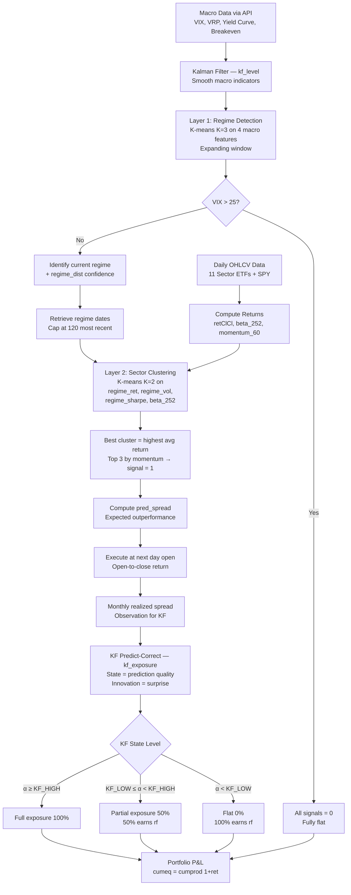

# FIN 452 — Strategy Context & Mental Model
Last updated: 2026-04-07

> **Graded deliverable.** Single source of truth for all strategy design decisions. Every line of code in `trading_strategy.qmd` must trace back to something documented here.

---

# Part I: Project Requirements

> Immutable reference. Constraints, deadlines, and code patterns mandated by the course.

---

## 1. Deliverables & Deadlines

| Item | Format | Details |
|------|--------|---------|
| Quarto source | `.qmd` file | All analysis in R, no Python |
| Rendered output | **Self-contained HTML** | All resources embedded. **-5 points** if professor has to re-render. |
| Strategy context | `context.md` | This file — living document, **graded deliverable** |
| GitHub repo | **Public** | Daily commits. **-5 points** for single commit on submission day. |
| Presentation | 10 minutes, in class | Recorded for grading only. May be peer-graded. |

| Item | Date |
|------|------|
| **Due date** | **2026-04-07, 6:00 PM Edmonton time** |
| Presentation | In class on 2026-04-07 |
| Submission | Email with GitHub repo link |

## 2. Grading

| Detail | Value |
|--------|-------|
| Weight | **20%** of course grade |
| Type | Individual assignment |
| Penalties | -5 non-self-contained HTML; -5 no daily commits; penalty for Python |

## 3. Hard Constraints

### 3.1 Asset Universe (FIXED)

| Ticker | Sector | Available From |
|--------|--------|---------------|
| **SPY** | S&P 500 (benchmark) | 1993 |
| XLB | Materials | 1998 |
| XLC | Communication Services | **2018** |
| XLE | Energy | 1998 |
| XLF | Financials | 1998 |
| XLI | Industrials | 1998 |
| XLK | Technology | 1998 |
| XLP | Consumer Staples | 1998 |
| XLRE | Real Estate | **2015** |
| XLU | Utilities | 1998 |
| XLV | Health Care | 1998 |
| XLY | Consumer Discretionary | 1998 |

### 3.2 Time Periods (FIXED)

| Period | Range |
|--------|-------|
| **Training** | **June 2000 – December 2024** |
| **Testing** | **January 2025 – March 2026** |

### 3.3 Strategy Method (MANDATORY)

| Requirement | Detail |
|-------------|--------|
| **Clustering** | PRIMARY method to drive signals |
| **Kalman Filter** | IN CONJUNCTION with clustering to trigger trade signals |
| Indicators | Free to use any |
| Trading frequency | **Daily** |
| Rebalancing | **Monthly** |

### 3.4 Technical Requirements

| Requirement | Detail |
|-------------|--------|
| Language | **R only** — Python penalized |
| Document | **Quarto** (.qmd) |
| Workflow | **tidymodels** |
| Data | **All via APIs** — no local CSV/Excel |
| Mental model | **Mermaid charts** |
| Code-model match | Code must match diagram |

## 4. Required Components

### 4.1 Data & Returns
- [x] Load all SPDR sector ETFs + SPY via `tidyquant::tq_get()`
- [x] Adjust OHLC via `quantmod::adjustOHLC()`
- [x] Compute returns: `retClCl` (primary), open-to-close on execution days
- [x] Handle XLC (2018) and XLRE (2015) availability gaps
- [x] Load indicator data via APIs (FRED, Yahoo)

### 4.2 Clustering (PRIMARY — Two-Layer Architecture)
- [x] Layer 1: K-means on 4 Kalman-smoothed macro features (K=3 regimes)
- [x] Layer 2: K-means on 4 regime-conditional sector features (K=2 sector groups)
- [x] Expanding window clustering — no lookahead
- [x] Silhouette + elbow diagnostics for both layers
- [x] Cluster centroid profiles and regime characterization

### 4.3 Kalman Filter (REQUIRED — Predict-Correct Framework)
- [x] `kf_level()`: Smooths macro indicators before Layer 1 clustering
- [x] `kf_exposure()`: Predict-correct on clustering prediction quality — directly triggers trade exposure
- [x] Clustering = prediction, market returns = observation
- [x] KF state estimate determines exposure scaling (0%, 50%, 100%)
- [x] Training MLE parameters (V, W) frozen for test period; filter continues from training final state

### 4.4 Mermaid Mental Model
- [ ] Flowchart: data → KF smoothing → Layer 1 clustering → Layer 2 clustering → KF predict-correct → exposure scaling → trade
- [ ] Code must match diagram exactly

### 4.5 Trade & Position Logic
- [x] Signals: {0, +1} per sector (long-only, N_SHORT=0)
- [x] Signal at month-end close → execute at next trading day open (open-to-close return on exec day)
- [x] Monthly rebalancing cadence
- [x] KF scales exposure: full (1.0), partial (0.5), flat (0.0)
- [x] Uninvested capital earns rf_daily (^IRX / 252)

### 4.6 Strategy Function & Optimization
- [x] `two_layer_signal()` and `opt_signals()` for signal generation
- [x] `opt_metrics()` for P&L chain with KF scaling
- [x] Grid search over KF_HIGH_Q × KF_LOW_Q (5% increments, ~52 combos)
- [x] Multi-core via `foreach` + `doParallel`
- [x] Optimize on TRAINING period only; Omega (L=0) as objective

### 4.7 Risk/Reward Assessment
- [x] Sharpe Ratio, Omega Ratio, Max Drawdown, CAGR
- [x] Drawdown charts for training and test
- [x] Benchmark comparisons: SPY B&H, 50/50 SPY+Top3, 100% Defensive, 100% Cyclical

### 4.8 Visualization
- [x] Cumulative return charts (strategy vs 4 benchmarks)
- [x] KF diagnostics: state chart, innovation chart, prediction vs realization scatter
- [x] Regime timeline heatmap
- [x] Sector cluster assignment heatmap
- [x] Sector signal heatmap
- [x] Sector selection frequency by regime
- [x] Regime-conditional sector profiles (return + beta)
- [x] KF exposure decisions by regime
- [x] Regime confidence (distance to centroid) over time
- [x] Layer 2 cluster centroid snapshots (systematic dates)
- [x] Per-sector silhouette bar plot (Layer 2)
- [x] Elbow + silhouette diagnostics (both layers)
- [x] PCA biplot (Layer 1)
- [x] Drawdown charts (training + test)
- [x] Optimization heatmap (white-to-green)
- [ ] Mermaid decision flowchart (mandatory)

### 4.9 Backtesting
- [x] Walk-forward on test period with optimized KF thresholds
- [x] Compare vs SPY B&H + 3 additional benchmarks
- [x] Full performance stats on test period
- [x] KF continues from training state — no re-estimation

### 4.10 Presentation
- [ ] 10-minute presentation
- [ ] Thesis → method → results → conclusions

## 5. Bias Warnings

| Trap | How to Avoid |
|------|-------------|
| Survivorship bias | Fixed SPDR universe; note XLC/XLRE start dates |
| Look-ahead bias | Lag all signals; expanding window clustering; open-price execution; causal KF only |
| Data mining/snooping | Optimize on training only; test untouched; only KF thresholds optimized |
| Storytelling | Systematic snapshot dates, not cherry-picked; show failures alongside successes |
| Transaction costs | 5 bps/side on weight turnover; open-to-close on execution days |
| Outlier dependence | Check performance isn't driven by 1-2 events |
| Adjusted prices | Use `adjustOHLC()` |

## 6. Required R Packages

| Package | Purpose |
|---------|---------|
| `tidyverse` | Data wrangling |
| `tidyquant` | Yahoo Finance + FRED data |
| `tidymodels` | **Mandatory workflow** |
| `timetk` | xts ↔ tibble conversion |
| `quantmod` | OHLC adjustment |
| `plotly` | Interactive charts |
| `foreach` / `doParallel` | Multi-core optimization |
| `dlm` | Kalman filter (local level model, MLE, dlmFilter) |
| `cluster` | Silhouette analysis |
| `patchwork` | Side-by-side ggplots |
| `slider` | Rolling momentum computation |
| `scales` | Formatting percentages |
| `lubridate` | Date manipulation |

## 7. Reference Code Patterns

### 7.1 Data Loading & OHLC Adjustment
```r
dat <- tidyquant::tq_get("SPY", from = "2000-01-01") %>%
  dplyr::rename_all(tools::toTitleCase) %>%
  timetk::tk_xts(date_var = Date) %>%
  quantmod::adjustOHLC(., use.Adjusted = TRUE) %>%
  timetk::tk_tbl(rename_index = "Date") %>%
  dplyr::select(-Adjusted) %>%
  dplyr::mutate(across(where(is.numeric), round, 2)) %>%
  dplyr::rename(date = Date)
```

### 7.2 Return Types
```r
retClCl = Close / dplyr::lag(Close) - 1   # holding days
ret_oc  = Close / Open - 1                # execution days (buy at open)
```

---

# Part II: Strategy Design (Current Implementation)

> Reflects the actual state of `trading_strategy.qmd` as of 2026-04-07.

---

## A. Investment Thesis

**Core claim:** Financial markets exhibit distinct regime states — risk-on, risk-off, transitional — identifiable by clustering macro indicators. Sectors respond differently to each regime. By (1) detecting the regime via macro clustering, (2) selecting outperforming sectors within that regime, and (3) using a Kalman filter predict-correct framework to validate whether predictions match reality, we build a systematic sector rotation strategy with principled exposure control.

**Why two-layer clustering?** Layer 1 captures the macro environment (what regime are we in?). Layer 2 captures sector dynamics within that regime (which sectors outperform here?). The regime conditions the sector clustering — the same sector can be an outperformer in one regime and underperformer in another.

**Why KF predict-correct?** The clustering layers predict which sectors should outperform. The KF tracks whether those predictions are actually confirmed by realized returns. When predictions work → full exposure. When they fail → reduce to rf. This replaces ad-hoc drawdown stops with a principled, forward-looking mechanism.

## B. Signal Architecture

### Pipeline Overview

```
Raw Data → KF Smoothing → Layer 1 (Regime) → Layer 2 (Sector) → Signals
                                                                     ↓
Market Returns → KF Predict-Correct → Exposure Scale → Final Positions
```

### Layer 1: Regime Detection

| Parameter | Value |
|-----------|-------|
| Method | K-means, expanding window |
| K | 3 (confirmed by silhouette) |
| Features | 4 Kalman-smoothed macro indicators |
| Output | Regime label + regime_dist (confidence) |

**Features:**

| Feature | Source | Economic Meaning |
|---------|--------|-----------------|
| VIX | Yahoo (^VIX) | Market-wide implied fear |
| VRP | VIX − SPY_rvol_21 | Fear premium vs realized stress |
| Yield curve | ^TNX − DGS2 (10Y − 2Y) | Monetary policy stance / recession signal |
| Breakeven inflation | T10YIE (FRED) | Inflation regime — orthogonal to yield curve and VIX |

All features are Kalman-filtered (`kf_level()`, local level model, MLE V/W, causal `dlmFilter` only) before clustering.

### Layer 2: Sector Clustering Within Regime

| Parameter | Value |
|-----------|-------|
| Method | K-means |
| K | 2 (confirmed by silhouette, avg = 0.42) |
| Input dates | Most recent dates in current regime (capped at 120) |
| Features | 4 regime-conditional sector features |
| Output | Best cluster + sector signals |

**Features:**

| Feature | Computation | Why |
|---------|-------------|-----|
| regime_ret | Mean daily return over regime dates | Sector performance in this environment |
| regime_vol | SD of daily returns over regime dates | Risk in this environment |
| regime_sharpe | regime_ret / regime_vol | Risk-adjusted performance |
| beta_252 | Current day's 252d rolling beta to SPY | Cyclical/defensive characterization (not regime-averaged) |

**Signal assignment:**
1. Best cluster = highest average regime_ret
2. Within best cluster: rank by 60d momentum
3. Top N_LONG (max 3) sectors → signal = 1
4. Everything else → signal = 0

**VIX gate:** If VIX > VIX_THRESHOLD (25), all signals = 0 (fully flat).

### Kalman Filter Predict-Correct (Exposure Scaling)

| Parameter | Value |
|-----------|-------|
| Model | Local level (random walk + noise), `dlmModPoly(1)` |
| Observation (y_t) | Monthly realized return spread: mean(ret[signal=1]) − mean(ret[signal=0]) |
| State (α_t) | Latent prediction quality — how well clustering picks outperform |
| V, W | MLE on training data, frozen for test |
| Test initialization | m0 = training final state (seamless transition) |

**Predict-correct cycle (monthly):**
1. **Predict:** KF propagates prior state → α̂_{t|t-1}
2. **Observe:** Month's actual returns → compute realized spread y_t
3. **Correct:** α̂_{t|t} = α̂_{t|t-1} + G_t × (y_t − α̂_{t|t-1})

**Exposure mapping:**

| KF State | Exposure | Action |
|----------|----------|--------|
| α ≥ KF_HIGH | 1.0 (full) | Predictions confirmed → invest fully |
| KF_LOW ≤ α < KF_HIGH | 0.5 (partial) | Uncertain → half in picks, half in rf |
| α < KF_LOW | 0.0 (flat) | Predictions failing → all in rf |

**Innovation override (directional):**
- Large positive innovation (market outperformed predictions) → increase exposure one level
- Large negative innovation (model failing) → decrease exposure one level

**Uninvested capital:** `(1 − kf_scale) × rf_daily` (^IRX / 252)

## C. Fixed Parameters

| Parameter | Value | Rationale |
|-----------|-------|-----------|
| K_CLUSTERS | 3 | Silhouette-optimal for Layer 1 |
| K_SECTORS | 2 | Silhouette-optimal for Layer 2 (avg = 0.42, no misclassification) |
| N_LONG | 3 | Max sectors long from best cluster |
| N_SHORT | 0 | Long-only strategy |
| VIX_THRESHOLD | 25 | Hard gate — flat when VIX exceeds |
| MAX_REGIME_DAYS | 120 | Cap on regime history for responsiveness |
| TC_BPS | 0.0005 | 5 bps per side |

## D. Optimized Parameters (Grid Search)

| Parameter | Range | Increment |
|-----------|-------|-----------|
| KF_HIGH_Q | 0.40 – 0.85 | 5% |
| KF_LOW_Q | 0.05 – 0.40 | 5% |

Filtered to KF_HIGH_Q > KF_LOW_Q. ~52 valid combinations.

**Objective:** Maximize Omega (L=0) — captures tail asymmetry better than Sharpe for fat-tailed distributions.

**KF_HIGH and KF_LOW absolute thresholds** are derived as quantiles of the training-period KF state distribution, then frozen for test.

## E. Execution Model

| Parameter | Value |
|-----------|-------|
| Signal generation | Month-end close |
| Trade execution | Open of next trading day |
| Execution day return | Open-to-close (Close/Open − 1) |
| Holding day return | Close-to-close (Close/lag(Close) − 1) |
| Position sizing | Equal-weight: 1/n_long per active sector |
| KF exposure applied | Monthly, lagged by 1 month (observe → scale next month) |

## F. Benchmark Strategies

| Benchmark | Construction |
|-----------|-------------|
| SPY Buy & Hold | 100% SPY, no rebalancing |
| 50% SPY + 50% Top 3 | 50% SPY + 50% EW top 3 sectors by 60d momentum, rebalanced monthly |
| 100% Defensive | EW XLU, XLP, XLV, XLRE — buy and hold |
| 100% Cyclical | EW XLK, XLY, XLF, XLI, XLB, XLE, XLC — buy and hold |

## G. Sector Classification

| Group | Sectors | Characteristic |
|-------|---------|----------------|
| **Defensive** | XLU, XLP, XLV, XLRE | Inelastic demand / rate-sensitive, hold up in downturns |
| **Cyclical** | XLK, XLY, XLF, XLI, XLB, XLE, XLC | Tied to economic cycle, growth, commodities |

Note: XLC is growth-dominated (META, GOOG) — classified cyclical. XLRE is rate-sensitive — grouped with defensives by convention but arguable.

## H. Lookahead Bias Rules

| Layer | Rule |
|-------|------|
| Kalman filter (smoothing) | `dlmFilter()` only (causal). Never `dlmSmooth()`. |
| Kalman filter (exposure) | Observe month M returns → scale month M+1 (1-month lag) |
| Rolling calculations | Always `align = "right"`. Never `"center"`. |
| Signal execution | Signal on month-end close → execute at next day open |
| Execution returns | Open-to-close on exec day; close-to-close thereafter |
| Clustering | Expanding window only. Fit on data[1:T] at each rebalancing T. |
| KF parameters | V, W estimated on training only. Frozen for test. |
| KF thresholds | Quantiles of training-period state distribution. Frozen for test. |

## I. Decision Log

| Date | Decision | Rationale |
|------|----------|-----------|
| 2026-03-31 | Strategy: clustering + Kalman + sector rotation | Mandated by project brief |
| 2026-03-31 | Cluster time periods, not sectors | Need regime labels per date |
| 2026-03-31 | Option A: Kalman filter indicators before clustering | Cleanest pipeline, most interpretable |
| 2026-03-31 | Expanding window clustering | Avoids look-ahead bias |
| 2026-04-05 | Use `dlmFilter()` only, never `dlmSmooth()` | Smoother uses future data = lookahead |
| 2026-04-05 | 21-trading-day rolling vol (matches VIX 30-cal-day horizon) | Apples-to-apples comparison |
| 2026-04-05 | Yield curve = 10Y−2Y (^TNX − DGS2) | 2Y prices Fed expectations; more responsive |
| 2026-04-05 | T10YIE breakeven inflation as clustering feature | Orthogonal inflation dimension |
| 2026-04-06 | Two-layer clustering: macro regime → sector clustering within regime | Layer 2 output depends on regime — different sectors cluster differently per environment |
| 2026-04-06 | K_CLUSTERS=3 (Layer 1), K_SECTORS=2 (Layer 2) | Both confirmed by silhouette analysis |
| 2026-04-06 | beta_252 as Layer 2 feature (current value, not regime-averaged) | Already a 252d rolling estimate; regime-averaging is redundant |
| 2026-04-06 | N_LONG as cap, not target | Best cluster may have <3 members; don't spill into worse cluster |
| 2026-04-06 | KF predict-correct replaces DD stop | KF measures model quality directly (leading indicator) vs drawdown (lagging) |
| 2026-04-06 | Positive innovation → more investment; negative → less | Market outperforming predictions means model is working, not failing |
| 2026-04-06 | KF exposure: 3 levels (0%, 50%, 100%) with innovation override | Simple, interpretable; avoids continuous scaling complexity |
| 2026-04-06 | Quantile-based KF thresholds | Scale-invariant; training quantiles frozen for test |
| 2026-04-07 | Only optimize KF_HIGH_Q and KF_LOW_Q | All other params fixed — reduces overfitting risk, grid is focused |
| 2026-04-07 | Open-to-close returns on execution days | Realistic — can't trade at the close price used for signal generation |
| 2026-04-07 | 5% increment grid over wider KF range | Finer resolution for threshold sensitivity; ~52 valid combos |
| 2026-04-07 | Added benchmark strategies (50/50, defensive, cyclical) | Context for strategy performance beyond just SPY B&H |

## J. Assumptions & Limitations

**Assumptions:**
1. Market regimes exist and are detectable from macro indicators
2. Regimes persist long enough for monthly rebalancing to capture
3. Historical sector-regime relationships stable enough to predict forward
4. KF predict-correct mechanism adds value over raw clustering signals
5. Sector ETFs are liquid enough for realistic backtest
6. 5 bps/side transaction costs are representative

**Limitations:**
1. K-means is unsupervised — cluster labels don't inherently map to economic regimes
2. K is a hyperparameter — wrong K produces meaningless clusters
3. Kalman filter adds lag — may miss fast regime shifts
4. KF monthly updates are slow — takes several months to confirm regime shift
5. XLC (2018) and XLRE (2015) shorter history — asymmetric analysis
6. Monthly rebalancing cannot react to intra-month shifts
7. KF V/W frozen from training — signal-to-noise ratio may differ in test
8. Test period (13 months) too short to demonstrate crash-protection value
9. Training KF thresholds calibrated on data including 2008/2020 — may be overly conservative for benign test period

## K. Mermaid Mental Model


