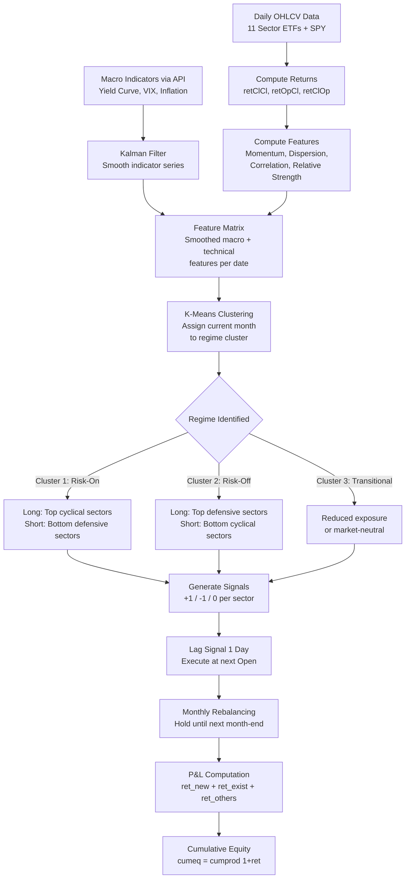

# Strategy Context & Mental Model
Last updated: 2026-03-31

> This is a **graded deliverable** (`context.md`). It is the single source of truth for all strategy design decisions. Every line of code in `trading_strategy.qmd` must trace back to something documented here. Update this file whenever a design choice is made or changed.

---

## 1. Investment Thesis

**Core claim:** Financial markets exhibit distinct regime states — risk-on, risk-off, transitional — that can be identified by clustering a set of macro and technical indicators. Sectors respond differently to each regime. By (1) classifying the current market regime via clustering, (2) smoothing noisy regime signals with a Kalman filter, and (3) rotating into sectors that historically outperform in the detected regime, we can build a systematic sector rotation strategy that outperforms buy-and-hold SPY.

**Economic mechanism:**
- **Regime existence:** Markets cycle through expansion, contraction, and transition states. These regimes are driven by monetary policy, credit conditions, and growth expectations. Different sectors have different sensitivities to these drivers (beta to rates, growth, commodities, etc.).
- **Why clustering?** Regimes are multivariate — no single indicator captures them. Clustering algorithms (K-means, hierarchical, etc.) can identify natural groupings in multi-dimensional indicator space, assigning each time period to a regime without imposing arbitrary thresholds.
- **Why Kalman filter?** Raw cluster assignments are noisy and can flip frequently, causing excessive trading. A Kalman filter smooths the regime signal (or the underlying indicators feeding the clustering), reducing whipsaws and improving signal quality. It also provides a probabilistic framework — we can use the filtered state estimate to gauge regime confidence.

**Why this beats a simple SMA crossover:**
- Multi-dimensional regime detection vs single price-based rule
- Economically grounded in business cycle theory
- Adaptive — clusters are learned from data, not hand-tuned thresholds
- Kalman smoothing adds robustness that hard threshold rules lack

**Status:** Thesis defined. Needs validation through exploratory analysis — do clusters correspond to economically meaningful regimes?

---

## 2. Universe & Instruments

**Mandated assets** (no choice — project requirement):

| Ticker | Sector | Available From | Cycle Sensitivity |
|--------|--------|---------------|-------------------|
| **SPY** | S&P 500 ETF (benchmark) | 1993 | Market |
| XLB | Materials | 1998 | Cyclical / commodity |
| XLC | Communication Services | **Jun 2018** | Growth / tech-adjacent |
| XLE | Energy | 1998 | Commodity / inflation |
| XLF | Financials | 1998 | Rate-sensitive / cyclical |
| XLI | Industrials | 1998 | Cyclical / capex |
| XLK | Technology | 1998 | Growth / secular |
| XLP | Consumer Staples | 1998 | Defensive |
| XLRE | Real Estate | **Oct 2015** | Rate-sensitive / defensive |
| XLU | Utilities | 1998 | Defensive / yield |
| XLV | Health Care | 1998 | Defensive / secular |
| XLY | Consumer Discretionary | 1998 | Cyclical / consumer |

**Data availability strategy:**
- Training starts June 2000. At that point, 9 of 11 sector ETFs are available.
- XLRE joins Oct 2015. XLC joins Jun 2018.
- **Approach:** Use the available sectors at each point in time. Clustering and portfolio weights adapt as the universe expands. This avoids survivorship bias and uses maximum data.

**Data sources (all via API — no local files allowed):**

| Data | Source | R Package | Frequency |
|------|--------|-----------|-----------|
| Sector ETF OHLCV | Yahoo Finance | `tidyquant::tq_get()` | Daily |
| SPY OHLCV | Yahoo Finance | `tidyquant::tq_get()` | Daily |
| 10Y Treasury yield (DGS10) | FRED | `fredr` | Daily |
| 2Y Treasury yield (DGS2) | FRED | `fredr` | Daily |
| Fed Funds Rate (DFF) | FRED | `fredr` | Daily |
| VIX (^VIX) | Yahoo Finance | `tidyquant::tq_get()` | Daily |
| Breakeven inflation (T10YIE) | FRED | `fredr` | Daily |
| Additional indicators | FRED / Yahoo | Various | TBD |

**Status:** Universe is fixed by project brief. Indicator data sources identified. Need to test all API pulls.

---

## 3. Signal Architecture

The strategy uses a **three-layer signal pipeline**: Indicators → Clustering → Kalman Filter → Trade Signal.

### Layer 1: Indicator Features (Input to Clustering)

These indicators characterize the market environment at each point in time. They are the features that the clustering algorithm uses to classify regimes.

| Indicator | Computation | Economic Meaning | Source |
|-----------|-------------|-----------------|--------|
| Yield curve slope | DGS10 - DGS2 | Monetary policy stance / recession signal | FRED |
| VIX level | Raw VIX close | Market fear / volatility regime | Yahoo |
| VIX momentum | N-day change in VIX | Volatility trend — rising fear vs calming | Yahoo |
| Sector momentum dispersion | Std dev of N-day returns across sectors | High dispersion = sectors diverging = rotation opportunity | Computed |
| Cross-sector correlation | Rolling average pairwise correlation of sector returns | High corr = risk-off herding; low corr = differentiated regime | Computed |
| Sector relative momentum | Each sector's N-day return minus SPY N-day return | Which sectors are leading/lagging the market | Computed |
| Breakeven inflation | T10YIE | Inflation expectations — drives Energy, Materials, TIPS-sensitive sectors | FRED |
| Credit spread proxy | (Computed from available FRED series or ETF spreads) | Credit conditions — expansion vs stress | FRED |

**Lag requirements:**
- All FRED data: available same day → apply 1-day execution lag
- Price-derived indicators: computed on day T close → trade at open of T+1
- Monthly rebalancing: signals evaluated on last trading day of month → rebalance at open of first trading day of next month

**Parameters to potentially optimize:**
- Momentum lookback window (N days: 20, 40, 60, 90)
- Rolling correlation/dispersion window
- Number of clusters (K)

### Layer 2: Clustering (PRIMARY Signal — Mandatory)

**Method:** K-means clustering (or hierarchical) via `tidymodels` workflow.

**Process:**
1. At each monthly rebalancing date, take the current values of all Layer 1 indicators.
2. Cluster the historical indicator observations into K regimes.
3. Assign the current date to its nearest cluster.
4. Each cluster maps to a regime interpretation (e.g., "risk-on expansion", "risk-off contraction", "transitional").

**Tidymodels implementation:**
- `recipes::recipe()` to preprocess indicators (normalize, handle NAs)
- `parsnip` or direct `stats::kmeans()` / `cluster` package for clustering
- `tune` for selecting optimal K if treating it as a hyperparameter

**Cluster-to-signal mapping:**
- After clustering, analyze historical sector returns within each cluster.
- For each cluster/regime, rank sectors by average historical return.
- When the current regime is identified → go long the top-performing sectors for that regime, short the bottom.

**Key question to resolve:** Do we cluster the *time periods* (each row = one date's indicator values) or the *sectors* (each row = one sector's feature vector)?

**Answer: Cluster the time periods.** Each date gets assigned a regime label based on its indicator values. Then we look at which sectors performed well in similar historical regimes. This matches the "regime detection → sector rotation" thesis.

### Layer 3: Kalman Filter (REQUIRED — With Clustering)

**Purpose:** Smooth the regime signal to reduce whipsaw trades.

**Approach options (choose one — decision pending):**

| Option | Description | Pros | Cons |
|--------|-------------|------|------|
| **A: Filter the indicators before clustering** | Apply Kalman filter to each indicator time series to denoise them. Then cluster on smoothed indicators. | Cleaner clustering input; fewer spurious regime changes | Adds lag to signal; may smooth away real regime shifts |
| **B: Filter the cluster assignment** | Run clustering on raw indicators. Then treat the cluster label (or cluster centroid distance) as a noisy observation and Kalman-filter the regime state. | Preserves raw clustering; Kalman handles the regime transition smoothing | Cluster labels are categorical — need to map to continuous state for Kalman |
| **C: Filter a key signal, cluster the rest** | Kalman-filter one or two key indicators (e.g., yield curve, VIX) while leaving others raw. Cluster on the mixed set. | Targeted smoothing where it matters most | More complex to justify |

**Current lean: Option A** — filter the indicators before clustering. This is the cleanest integration and produces the most interpretable pipeline: raw data → Kalman-smoothed indicators → clustering → regime → sector allocation.

**Kalman filter implementation:**
- Use `dlm` or `KFAS` package in R
- Local level model (random walk + noise) for each indicator
- Kalman gain adapts automatically to signal-to-noise ratio

**Status:** Architecture defined at high level. Option A vs B vs C to be decided after exploratory analysis.

---

## 4. Signal Combination Logic

```
MONTHLY REBALANCING CYCLE (last trading day of each month):

1. COLLECT current values of all indicators (Layer 1)
2. APPLY Kalman filter to smooth indicator time series
3. CLUSTER: assign current month to a regime using K-means on smoothed indicators
4. LOOKUP: for the identified regime cluster, retrieve historical sector return rankings
5. ALLOCATE:
   - Long: top-K sectors for this regime (highest historical avg return in this cluster)
   - Short: bottom-K sectors (or flat if long-only preferred)
   - Flat: middle sectors
6. GENERATE signals: +1 (long), -1 (short), 0 (flat) per sector
7. LAG: signals from month-end T → execute at open of first trading day of month T+1
8. HOLD positions for the entire month until next rebalancing
```

**Portfolio construction:**
- Equal-weight across active long positions
- Equal-weight across active short positions
- Total gross exposure = 100% long + 100% short (if going long-short)
- OR: long-only variant where short signals → go to cash (0)

**Monthly rebalancing cadence:**
- Signals generated: last trading day of each month
- Execution: open of first trading day of next month
- Hold: entire month
- This matches the project requirement of "monthly rebalancing"

**Status:** Logic defined. Need to decide long-short vs long-only, and exact K (number of sectors to hold).

---

## 5. Execution Model

| Parameter | Value | Rationale |
|-----------|-------|-----------|
| **Signal generation** | Last trading day of month (after close) | Monthly rebalancing requirement |
| **Trade execution** | Open of first trading day of next month | Realistic — can't trade at close used for signal |
| **Signal lag** | 1 trading day minimum | Built into trade logic |
| **Position sizing** | Equal-weight across active positions | Simple, avoids extra optimization dimension |
| **Rebalancing** | Monthly | Project requirement |
| **Trading frequency** | Daily data, monthly decisions | Daily P&L tracking, monthly signal changes |
| **Slippage** | Acknowledged in discussion; sector ETFs are highly liquid | Course expects awareness |
| **Transaction costs** | Acknowledged qualitatively | Monthly rebalancing → ~12 trades/year per sector = low turnover |

**P&L computation (course-mandated pattern):**
- `retClCl` = Close[t] / Close[t-1] - 1
- `retOpCl` = (Close - Open) / Close
- `retClOp` = Open[t] / Close[t-1] - 1
- `ret_new` = new position day: `pos * retOpCl`
- `ret_exist` = held position, no trade: `pos * retClCl`
- `ret_others` = position change day: `(1 + retClOp*(pos-trade)) * (1 + retOpCl*pos) - 1`
- `cumeq` = `cumprod(1 + ret)`

**Multi-asset aggregation:**
- Compute per-sector returns using the pattern above
- Portfolio return = weighted average of sector returns (equal weight)

**Status:** Execution model follows course template. Multi-asset aggregation approach needs implementation.

---

## 6. Train/Test Split

| Period | Dates | Duration | Rationale |
|--------|-------|----------|-----------|
| **Training** | **June 2000 – December 2024** | 24.5 years | Project requirement. Covers dot-com bust, GFC, post-GFC QE, COVID, 2022 rate hiking, 2023-24 recovery. Multiple full business cycles. |
| **Testing** | **January 2025 – March 2026** | 15 months | Project requirement. Fully out-of-sample. |

**Data availability within training:**
| Period | Available Sectors |
|--------|------------------|
| Jun 2000 – Sep 2015 | 9 sectors (no XLRE, no XLC) + SPY |
| Oct 2015 – May 2018 | 10 sectors (add XLRE) + SPY |
| Jun 2018 – Dec 2024 | All 11 sectors + SPY |

**Handling:** Clustering uses whatever sectors are available at each date. Sector rankings within each cluster are computed only for sectors that existed during that cluster's historical periods.

**Status:** Fixed by project brief. No flexibility here.

---

## 7. Optimization Design

| Parameter | Range | Step | Count | Rationale |
|-----------|-------|------|-------|-----------|
| `n_clusters` (K) | 2, 3, 4, 5 | 1 | 4 | Too few = no differentiation; too many = overfitting |
| `momentum_lookback` | 20, 40, 60, 90, 120 days | — | 5 | Captures different momentum time horizons |
| `n_long` (sectors to go long) | 2, 3, 4 | 1 | 3 | Balance concentration vs diversification |
| `n_short` (sectors to short) | 0, 2, 3 | — | 3 | 0 = long-only variant |

**Total combinations:** 4 × 5 × 3 × 3 = **180** (tractable with `doParallel`)

**Objective function:** Maximize **Sharpe Ratio** on training data.

**Secondary filters (risk appetite):**
- `DD.Max > -40%` (not worse than S&P worst drawdowns)
- `Omega > 1.0`
- `%.InMrkt > 50%`

**Overfitting mitigation:**
1. Coarse parameter grid — looking for robust regions, not precise peaks
2. Visual inspection of optimization surface for smooth hills
3. Select from dense clusters of good combinations, not global max
4. 24.5 years of training data reduces overfitting risk
5. Out-of-sample backtest is the final check

**Kalman filter parameters:** Fix at reasonable defaults (process noise, observation noise) rather than optimizing — adding Kalman params to the grid would explode the search space and the Kalman filter should be viewed as a preprocessing/smoothing step, not a tuning knob.

**Status:** Grid defined. Will finalize after confirming which indicators are most informative.

---

## 8. Risk Appetite Definition

| Metric | Threshold | Rationale |
|--------|-----------|-----------|
| Sharpe Ratio | > 0.3 | S&P long-term Sharpe ~0.4. Below 0.2 is indistinguishable from noise. |
| Omega Ratio | > 1.0 | Gains must outweigh losses on full distribution |
| Max Drawdown % | > -40% | S&P hit -57% in GFC, -34% in COVID. Strategy should protect somewhat. |
| Max DD Length | < 1000 trading days | ~4 years. S&P's GFC recovery was ~5.5 years. |
| % Win | > 48% | Slightly below 50% acceptable if avg win > avg loss |
| % In Market | > 60% | Must be active enough to justify the model complexity |
| Correlation to SPY | < 0.90 | Must add value beyond buy-and-hold |

**Selection process:**
1. Filter optimization results by all thresholds
2. Sort by Sharpe
3. Visualize candidates on parameter surface
4. Pick from the densest qualifying cluster (robustness > peak)

**Status:** Starting thresholds. Will calibrate after seeing optimization output.

---

## 9. Key Assumptions & Limitations

**Assumptions (must hold for strategy to work):**
1. Market regimes exist and are detectable from macro + technical indicators
2. Regimes are persistent enough that monthly rebalancing captures them (not too fast-moving)
3. Historical sector-regime relationships are stable enough to predict forward
4. Clustering on 24.5 years of data produces economically meaningful groupings
5. Kalman-filtered indicators reduce noise without introducing excessive lag
6. Sector ETFs are liquid enough for realistic backtest returns

**Limitations:**
1. **Clustering is unsupervised** — cluster labels may not correspond to clean economic regimes
2. **K is a hyperparameter** — wrong K produces meaningless clusters
3. **Kalman filter adds lag** — may cause late regime detection in fast-moving markets
4. **XLC/XLRE shorter history** — clustering and regime analysis is asymmetric across time
5. **Monthly rebalancing** — cannot react to intra-month regime shifts (but reduces turnover/costs)
6. **No transaction cost deduction** — returns are gross of costs
7. **Survivorship bias is low** for ETFs but sector definitions have changed (Communication Services created 2018)
8. **Look-ahead risk** in clustering: must use only data available up to the decision date (expanding window, not full-sample clustering)

**Critical implementation detail:** Clustering MUST be done on an **expanding window** basis — at each rebalancing date, only use data up to that date. DO NOT cluster on the full training set and then assign labels retroactively. This would be severe look-ahead bias.

---

## 10. Mermaid Mental Model

The project requires a Mermaid flowchart visualizing the decision logic. The code must match this diagram.



**Status:** Draft diagram. Will be refined as implementation proceeds. Must be embedded in the .qmd file.

---

## 11. Tidymodels Integration Plan

The project requires `tidymodels` workflow. Here's how it maps:

| tidymodels Component | Usage in This Strategy |
|---------------------|----------------------|
| `recipes::recipe()` | Preprocess indicator features: normalize, impute NAs, create derived features |
| `recipes::step_normalize()` | Scale indicators before clustering (K-means is distance-based) |
| `recipes::step_naomit()` or `step_impute_*()` | Handle missing indicator values |
| Clustering via tidymodels | `tidyclust` package (K-means, hierarchical) integrated with tidymodels |
| `tune::tune_grid()` | Potentially tune number of clusters K |
| `rsample` | Time-series cross-validation splits for validating cluster stability |
| `workflows::workflow()` | Bundle recipe + clustering model |

**Note:** `tidyclust` is the tidymodels-compatible clustering package. It provides `k_means()`, `hier_clust()` etc. that work with recipes and workflows.

**Status:** Integration plan sketched. Need to verify `tidyclust` is installed and compatible.

---

## 12. Decision Log

| Date | Decision | Rationale | Alternative Considered |
|------|----------|-----------|----------------------|
| 2026-03-31 | Strategy: Clustering-based regime detection + Kalman filter + sector rotation | Mandated by project brief — clustering is primary, Kalman required | N/A — these are hard requirements |
| 2026-03-31 | Cluster time periods (not sectors) | We need regime labels per date to drive rotation decisions. Clustering sectors would answer "which sectors are similar" not "what regime are we in" | Cluster sectors by return profiles |
| 2026-03-31 | Lean toward Option A: Kalman filter indicators before clustering | Cleanest pipeline, most interpretable, avoids categorical-to-continuous mapping issue | Option B (filter cluster labels), Option C (mixed) |
| 2026-03-31 | Use `tidyclust` for tidymodels-compatible clustering | Project mandates tidymodels workflow; tidyclust integrates natively | Raw stats::kmeans (works but doesn't satisfy tidymodels requirement) |
| 2026-03-31 | Expanding window clustering (not full-sample) | Avoids look-ahead bias — critical for honest backtest | Full-sample clustering (severe look-ahead bias) |
| 2026-03-31 | Fix Kalman parameters, don't optimize them | Keeps grid search tractable at 180 combinations; Kalman is preprocessing, not signal tuning | Include Kalman params in grid (explodes to 1000+) |
| 2026-03-31 | Training June 2000 – Dec 2024, Test Jan 2025 – Mar 2026 | Project requirement (fixed) | N/A |
| 2026-03-31 | Monthly rebalancing | Project requirement (fixed) | N/A |
